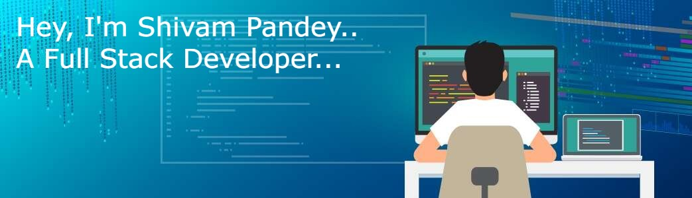

# Hi, I'm Shivam Pandey 👋🏾 👩🏾‍💻

💡 &nbsp;I'm a software engineer who is passionate about making contributing to open-source more approachable, creating efficient application to solve people problem, and building community to solve tech related doubt and solve programming problems. Some technologies I enjoy working with include NodeJs, Express as Backend , MongoDB as a NoSQL Database and ReactJs, Javascript, HTML, CSS, Tailwindcss, SCSS as Frontend . 

💡 &nbsp;I like to explore new technologies and develop software solutions and quick hacks. 
🌱 &nbsp;I'm on track for learning more about NextJs, TypeScript, create more efficient backend architecture and Cloud Architecture. 
✍️ &nbsp;In my free time, I pursue to solve Data Structure problem's and play cricket, table tennis and chess as hobbies/side hustles. 
💬 &nbsp;Feel free to reach out to me for pro bono consulting and volunteering, or just for some interesting discussion. 
✉️ &nbsp;You can shoot me an email at pshivam762@gmail.com! I'll try to respond as soon as I can. 
📄 &nbsp;Please have a look at my [Résumé]() for more details about me. I'm open to feedback and suggestions!. 

## Find me around the web 🌎: 
- Learning in public on <a href="https://masaischool.com">Masai School</a> or <a href="https://www.monica.dev">shivam.dev</a> 📹 ✍🏾
- Tinkering with interactions on <a href="https://codesandbox.io/u/ShivCodeP">Codesandbox</a> 🏓
- Sharing updates on <a href="https://www.linkedin.com/in/shivamadityapandey/">LinkedIn</a> 💼